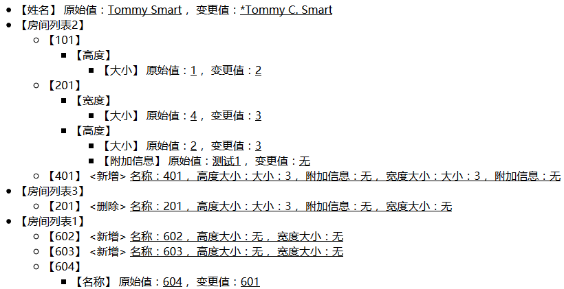

# DiffRender

轻量级差异比较渲染器，用于直观地显示两个对象之间的差异。

DiffRender有以下几个特点：

* 除Map类型外，支持所有对象的差异渲染
* 支持中文差异显示
* 差异值支持自定义函数渲染
* 生成易于遍历的差异结果，方便渲染，已自带Markdown风格的的HTML渲染器

## HOW TO USE
### 配置依赖(Maven:pom.xml)

添加依赖：

```xml
<dependency>
    <groupId>org.team4u.diff</groupId>
    <artifactId>diff-render</artifactId>
	<version>1.0.0</version>
</dependency>

<dependency>
    <groupId>org.team4u</groupId>
    <artifactId>team-kit-core</artifactId>
    <version>1.0.0</version>
</dependency>

<dependency>
    <groupId>com.xiaoleilu</groupId>
    <artifactId>hutool-core</artifactId>
    <version>3.0.9</version>
</dependency>
<dependency>
    <groupId>com.xiaoleilu</groupId>
    <artifactId>hutool-log</artifactId>
    <version>3.0.9</version>
</dependency>
<dependency>
    <groupId>com.xiaoleilu</groupId>
    <artifactId>hutool-crypto</artifactId>
    <version>3.0.9</version>
</dependency>

<!-- 可选，Markdown渲染HTML -->
<dependency>
    <groupId>com.atlassian.commonmark</groupId>
    <artifactId>commonmark</artifactId>
    <version>0.9.0</version>
</dependency>
```

添加仓库：

```xml
<repositories>
    <repository>
        <snapshots>
            <enabled>false</enabled>
        </snapshots>
        <id>bintray-team4u</id>
        <name>bintray</name>
        <url>https://dl.bintray.com/team4u/team4u</url>
    </repository>
</repositories>
```

### 渲染定义

在渲染差异前，我们要使用@Definition注解定义每一个需渲染的字段或者类。

只有定义了@Definition的属性才会进行渲染。

因Java会将泛型信息擦除，当对集合（如List、Array）定义时，还需要指定定义集合内元素的类型（refer）。

一些样例：

```java
@Definition("个人")
public class Person {
    private String login;
    @Definition(value = "姓名", formatter = "${c(value,'*')}")
    private String name;
    @Definition(value = "房间列表1", refer = Room.class)
    private List<Room> room1List;
    @Definition(value = "房间列表2", refer = Room.class)
    private List<Room> room2List;
    @Definition(value = "房间列表3", refer = Room.class)
    private List<Room> room3List;

    // 省略get/set
}

@Definition("房间")
public class Room implements Renderable {

    @Definition(value = "名称")
    private String name;

    @Definition("高度")
    private Size height;

    @Definition("宽度")
    private Size weight;

    // 省略get/set

    @Override
    public String toString() {
        return renderWholeValue();
    }

    @Override
    public String renderWholeValue() {
        return String.format("名称：%s， 高度大小：%s， 宽度大小：%s",
                ValueUtil.defaultIfNull(name, "无"),
                ValueUtil.defaultIfNull(height, "无"),
                ValueUtil.defaultIfNull(weight, "无"));
    }

    @Override
    public String renderKeyValue() {
        return name;
    }
}

@Definition("大小")
public class Size implements Renderable {
    @Definition("大小")
    private int size;

    @Definition("附加信息")
    private String desc;

    // 省略get/set

    @Override
    public String toString() {
        return renderWholeValue();
    }

    @Override
    public String renderWholeValue() {
        return String.format("大小：%s， 附加信息：%s",
                ValueUtil.defaultIfNull(size, "无"),
                ValueUtil.defaultIfNull(desc, "无"));
    }

    @Override
    public String renderKeyValue() {
        return size + "";
    }
}
```

### Renderable

```java
public interface Renderable {

    /**
     * 渲染完整数据
     */
    String renderWholeValue();

    /**
     * 渲染关键数据
     */
    String renderKeyValue();
}
```

子节点应该实现Renderable接口，用于渲染完整数据和关键数据。

* 完整数据用于新增或者删除时显示完整信息
* 关键数据用于中间路径显示可标识性的信息，如上述例子中的房间名称

### 格式化函数

我们注意到@Definition还有formatter属性，该属性用于自定义格式化字段值，如日期、金额等可能会有特殊格式要求。

在使用前我们需要自定义格式化函数，自定义函数必须为public的静态函数：

```java
public class MyValueFormatter {

    // 为值增加前缀
    public static void c(ChangeValues.Value value, String prefix) {
        if (value.getNewValue() != null) {
            value.setNewValue(prefix + value.getNewValue());
        }

        if (value.getOldValue() != null) {
            value.setOldValue(prefix + value.getOldValue());
        }
    }

    // 省略其他函数
}
```

然后注册该函数，只需注册一次：

```java
ValueFormatterRegistry.INSTANCE.registerTemplateFunction(MyValueFormatter.class);
```

最后在formatter中使用自定义函数：

```java
@Definition(value = "姓名", formatter = "${c(value,'*')}")
private String name;
```

其中value为内置的上下文，里面包含了新旧值。

### 渲染差异

首先构造差异数据：

```java
public Person createPerson1() {
    return new Person("tommy", "Tommy Smart")
            .setRoom1List(CollectionUtil.newArrayList(new Room().setName("604")))
            .setRoom2List(CollectionUtil.newArrayList(
                    new Room().setName("101").setHeight(new Size().setSize(1)),
                    new Room().setName("201").setHeight(new Size().setSize(2).setDesc("测试1")).setWeight(new Size().setSize(4))))
            .setRoom3List(CollectionUtil.newArrayList(new Room().setName("201").setHeight(new Size().setSize(3))));
}

public Person createPerson2() {
    return new Person("tommy", "Tommy C. Smart")
            .setRoom1List(CollectionUtil.newArrayList(new Room().setName("601"), new Room().setName("602"), new Room().setName("603")))
            .setRoom2List(CollectionUtil.newArrayList(
                    new Room().setName("101").setHeight(new Size().setSize(2)),
                    new Room().setName("201").setHeight(new Size().setSize(3)).setWeight(new Size().setSize(3)),
                    new Room().setName("401").setHeight(new Size().setSize(3)).setWeight(new Size().setSize(3))));
}
```

使用Markdown渲染器：

```java
SimpleMarkdownRender mdRender = new SimpleMarkdownRender("org.team4u.test.model", createPerson1(), createPerson2());
String md = mdRender.render();
System.out.println(md);
```

输出结果：

```markdown
* 【姓名】 原始值：<u>Tommy Smart</u>， 变更值：<u>*Tommy C. Smart</u>
* 【房间列表2】
  * 【101】
    * 【高度】
      * 【大小】 原始值：<u>1</u>， 变更值：<u>2</u>
  * 【201】
    * 【宽度】
      * 【大小】 原始值：<u>4</u>， 变更值：<u>3</u>
    * 【高度】
      * 【大小】 原始值：<u>测试1</u>， 变更值：<u>无</u>
  * 【401】 <新增> <u>名称：401， 高度大小：大小：3， 附加信息：无， 宽度大小：大小：3， 附加信息：无</u>
* 【房间列表3】
  * 【201】 <删除> <u>名称：201， 高度大小：大小：3， 附加信息：无， 宽度大小：无</u>
* 【房间列表1】
  * 【602】 <新增> <u>名称：602， 高度大小：无， 宽度大小：无</u>
  * 【603】 <新增> <u>名称：603， 高度大小：无， 宽度大小：无</u>
  * 【604】
    * 【名称】 原始值：<u>604</u>， 变更值：<u>601</u>
```

使用Html渲染器：

```java
SimpleHtmlRender htmlRender = new SimpleHtmlRender(mdRender);
String html = htmlRender.render();
System.out.println(html);
```

输出结果：



自定义渲染器：

请参考SimpleMarkdownRender代码实现。

END